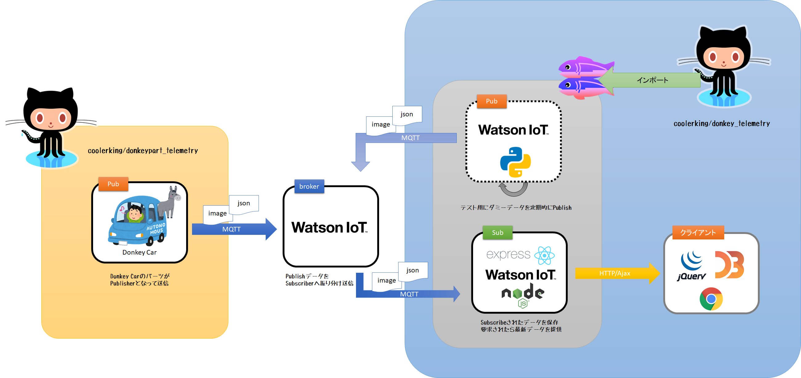

# Donkey Telemetry v3

Donkey Car上のパーツからMQTTブローカへ送信されているデータを可視化する。


## 表示データ


- （左）ステアリング値
   ステアリングを最左(-50) から最右(+50)までのアナログメータで表現する。正面は0を示す。入力デバイスにより-50,0,50しかとらない場合がある。
- （中央）画像イメージ
   最新のカメライメージ画像。静止画像である。
- （右）スロットル値
   スロットルレベルを最大100から速度0までで表現している。

## アーキテクチャ



MQTTをハブとした非同期通信で実現している。

- [Donkey Car](http://donkeycar.com)
   自律走行をRaspberryPiや市販のRCカーで実現できるオープンソースの自動運転プラットフォーム。
- [IBM Watson IoT Platform](https://www.ibm.com/jp-ja/marketplace/internet-of-things-cloud)
   IBM Cloud上で提供しているMQTTブローカサービス。検証はライトプランの無料枠で実施。
- [Glitch.com](https://glitch.com)
   Node.js開発・実行環境を無料で提供してくれるサービス。シェルコンソールもありpython3.xも既にインストール済みであるため、テストスクリプトの実行も可能。GitHub連携可能。

本リポジトリはGlitch.com上で動作するコードのみ格納されている。[Donkey Carパーツ](https://github.com/coolerking/donkeypart_telemetry) 側はこちらを参照のこと。

## インストール

### IBM Watson IoT Platform のセットアップ

1. [IBM Cloudコンソール](https://console.bluemix.net/login) へログイン
2. カタログを選択
3. IoTを選択
4. Internet of Things Platformを選択
5. デプロイする地域、組織の選択、スペースの選択を適当に入れる
6. ライトプランを選択
7. 作成ボタン押下
8. 起動ボタン押下
9. 画面右上のID:の後に続く文字列６文字を書き留める（組織ID）

### デバイスの登録

Donkey Carをデバイスとして登録する。ダミープログラムで動作だけ確認したい場合にもデバイスの認証情報を使用するので、この手順を行う。

1. ＋デバイスの追加ボタン押下
2. デバイスタイプ欄に`donkeycar`と入力
3. デバイスID欄にDonkey Carのホスト名（デバイスごとに一意な文字列）を入力
4. 次へボタン押下
5. 次へボタン押下
6. 次へボタン押下
7. 完了ボタン押下
6. デバイスタイプ、デバイスID、認証トークンを書きとめ、残しておく（なくすと作り直し）

> 個々で入手した認証情報はDonkey Car/ダミーパブリッシャ用であるので混同しないこと。


### アプリケーションの選択

IoT Platform でサブスクライバを作成する場合、「アプリケーション」として認証情報を取得し無くてはならない。

1. 左のメニューからアプリを選択
2. ＋APIキーの生成ボタン押下
3. 説明欄に適当に入力（複数作成する場合認識できるように書いておく）
4. 次へボタン押下
5. キーの生成ボタン押下
6. APIキーと認証トークンを書きとめ、残しておく（なくすと作り直し）
7. クローズの確認ボタン押下 


### Glitch プロジェクトの作成

1. [Glitch.com](https://glitch.com) を開く
2. GitHubユーザでログイン
3. New Projectボタン押下
4. hello-express を選択
5. 画面右上のプロジェクト名横のVボタンを押下
6. New Projectボタン押下

### ファイルの配置

1. 以下のファイルを配置する(ドラッグアンドドロップで配置可能)

* public/d3.css
* public/style.css
* public/viz.v1.js
* test/donkey.png
* test/pub.py
* test/test.jpg
* view/index.html
* package.json
* servers.js

### IoT Platform 認証情報の書き込み

1. `.env`の最終行に追加(書き留めたキーワードを入力、中括弧は削除、APP_IDはIoT Platforに接続するアプリで一意であれば適当で良い)
   ```ini
   ORG_ID={org_id}
   APP_ID=telemetry
   API_KEY={api_key}
   SECRET_TOKEN={security_token}
   ``` 

> SECRET_TOKENの生成文字列に寄ってはserver.jsの辞appClientConfigに直接書かないと認識しない場合がある。
> ```
>   "auth-token": "xskerHdjkd+*)({}"
> }
> ```

### ダミーパブリッシャの起動

Donkey Car側パーツのダミーを使用したい場合は、以下の手順を実行する

1. 画面右上のプロジェクト名横のVボタンを押下
2. Advanced Optionボタン押下
3. Open Console ボタン押下
4. 以下のコマンドを実行
   ```
   pip3 install docopt
   pip3 install ibmiotf
   ```
5. `test/<デバイスID>.ini`ファイルを作成し、以下のように編集(デバイス側の認証情報を記入する、組織IDは共通)
   ```ini
   [device]
   org={org_id}
   type=donkeycar
   id={device_id}
   auth-method=token
   auth-token={secret_token}
   clean-session=true
   ```
6. 以下のコマンドを実行して、ダミーパブリッシャを起動
   ```bash
   cd test
   python3 pub.py --conf <デバイスID>.ini
   ```

### Webアプリ画面の表示

1. Glitch画面にもどる
2. 画面右上のshowボタン押下

> ダミーパブリッシャは１つの画像歯科送信しないため、画像は変わらない（メータデータはランダム）。
